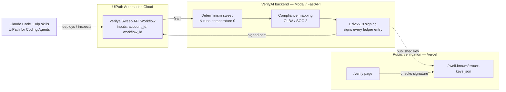
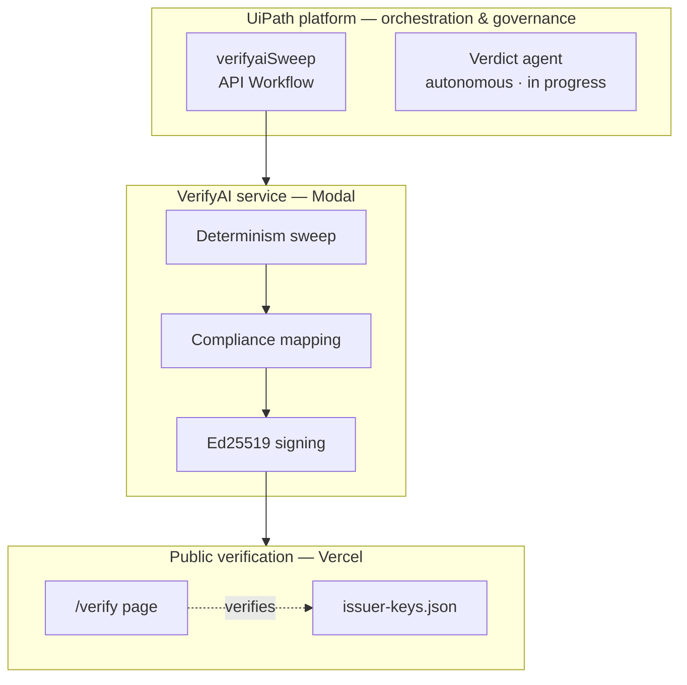
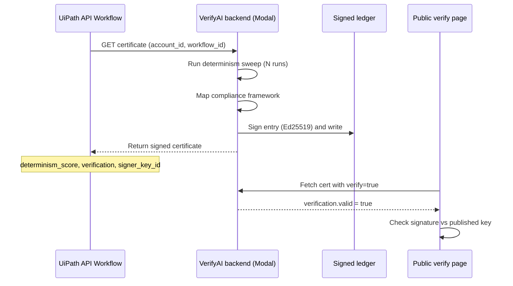
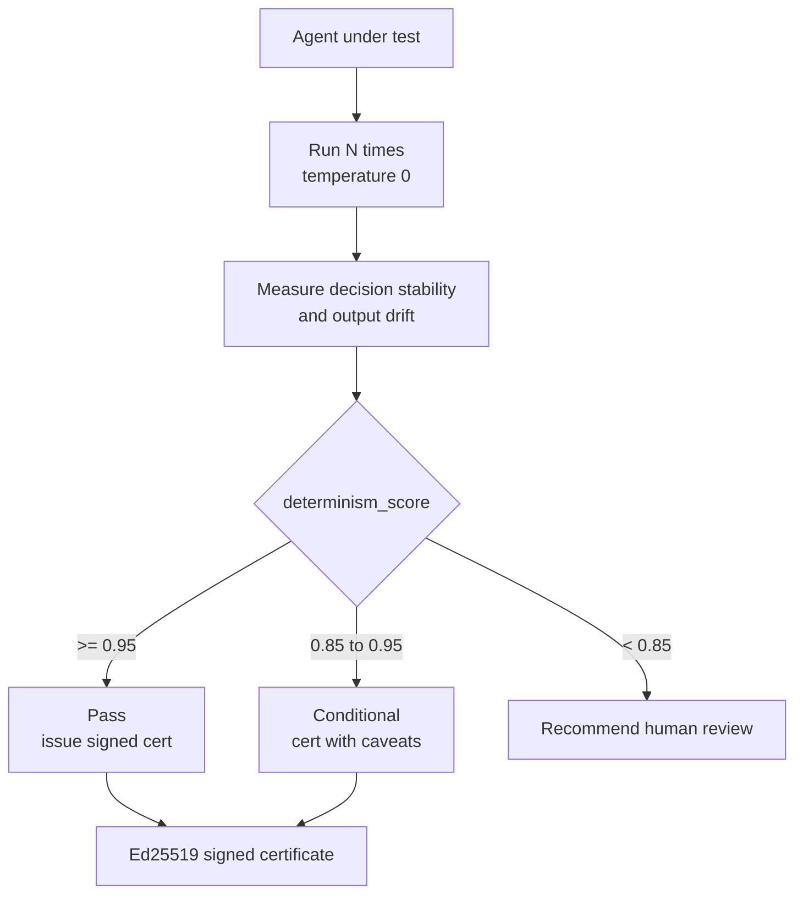
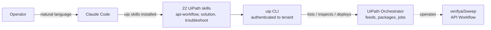

# VerifyAI for UiPath Test Cloud

**An independent third-party certification authority for AI agents — the UL of agentic software — wired into UiPath Automation Cloud.**

VerifyAI runs determinism and compliance probes against any LLM agent and issues **Ed25519-signed sweep certificates** that satisfy enterprise procurement and underwriter requirements. This submission demonstrates VerifyAI deployed as a Test Cloud integration inside UiPath: a parameterized **API Workflow** invokes VerifyAI's scoring backend and returns a cryptographically signed certificate that anyone can independently verify.

UiPath AgentHack 2026 · Track 3 (UiPath Test Cloud)

---

## The problem

Agentic software is going into regulated, high-stakes workflows — financial summaries, compliance decisions, customer-facing output — with no independent layer that certifies how an agent behaves. Self-attestation does not clear enterprise procurement or satisfy underwriters. There is no UL mark for AI agents.

VerifyAI is that layer. It is an issuer-paid, third-party certification authority. It probes an agent for determinism (does it produce equivalent decisions across N runs?) and compliance (does it hold up against a framework like GLBA?), then issues a signed certificate. The signature is checkable by anyone against a published issuer key, so the attestation is independent of both the vendor and the certifier's say-so.

## What this integration does

UiPath orchestrates a determinism and compliance probe against an AI agent and receives back a signed certificate from VerifyAI as an independent third party.

1. A UiPath **API Workflow** (`verifyaiSweep`) takes an `account_id` and `workflow_id`.
2. It calls the VerifyAI backend on Modal, which runs the determinism sweep and signs the result with an Ed25519 issuer key.
3. The workflow returns the full signed certificate — determinism score, decision stability, drift surface, signature, and signer key ID.
4. Anyone can paste the same account/workflow into the public verification page and confirm the Ed25519 signature against the published issuer key.

The certifier never holds risk and never sees real customer data: all probe data in this demo is synthetic.

---

## Architecture

End-to-end flow — a request enters through UiPath, gets scored and signed by the VerifyAI backend, and is independently verifiable on the public page.



Layered by platform tier — what runs where.



VerifyAI stays orchestrator-agnostic. UiPath is one orchestrator it plugs into; the integration is one-way reversible and does not couple VerifyAI to UiPath.

---

## Live components

| Component | URL |
|---|---|
| Verification page | https://verifyai-fin.vercel.app/verify |
| Public issuer key manifest | https://verifyai-fin.vercel.app/.well-known/issuer-keys.json |
| Certificate / verify endpoint | `https://vje013--verifyai-backend-certificate.modal.run` |

**Issuer key ID:** `verifyai-issuer-15805a06c294d5e2`
**Signature algorithm:** Ed25519

### Verify a certificate yourself

```bash
curl -s "https://vje013--verifyai-backend-certificate.modal.run?account_id=echelor-design-partner-01&workflow_id=echelor-ai-chat&verify=true"
```

Returns a verification block:

```json
{
  "sweep_id": "ECHELOR-AI-CHAT-1782695211",
  "account_id": "echelor-design-partner-01",
  "workflow_id": "echelor-ai-chat",
  "kind": "determinism",
  "verification": {
    "valid": true,
    "signer_key_id": "verifyai-issuer-15805a06c294d5e2",
    "algorithm": "Ed25519",
    "payload_sha256": "4299ef53a0d457a1..."
  },
  "signature_algorithm": "Ed25519",
  "public_key_url": "https://verifyai-fin.vercel.app/.well-known/issuer-keys.json",
  "issuer": "VerifyAI / Darwin Adaptive Systems"
}
```

The signature is checked against the public key published at the `public_key_url`. Tamper with any signed field and verification returns `valid: false`.

### Request sequence



---

## How the determinism test decides

Instead of asserting fixed outputs — which non-deterministic AI agents will never satisfy — VerifyAI runs the agent N times and scores decision stability and output drift.



---

## Design partner

**Echelor** (financial-services AI platform) is VerifyAI's first design partner. The workflows shown — `echelor-ai-chat` and related — represent Echelor's agent surfaces. All certificate data in this demo is synthetic; no real customer transactions, account numbers, or names appear anywhere in the demo environment.

---

## UiPath platform usage

| Capability | How it's used |
|---|---|
| **API Workflows** | `verifyaiSweep` — parameterized (`account_id`, `workflow_id`), HTTP Request to the VerifyAI backend, Response activity returns the signed certificate |
| **Test Cloud** | The integration runs as an agentic testing layer that scores an agent and issues a certificate |
| **Agent (Autonomous)** | A verdict-writer agent that reads the certificate and writes a one-paragraph compliance verdict — see Status below |

### Coding agents — UiPath for Coding Agents (bonus)

The UiPath skill catalog is installed into Claude Code (`uip skills install --agent claude`), authenticated to the `darwinadaptivesystemsllc / DefaultTenant` tenant. Claude Code operates the platform directly from the terminal — enumerating Orchestrator feeds, listing published packages, and deploying the API Workflow — blending a coding agent with the low-code component that bridges to the external VerifyAI service.



---

## Repository structure

```
verifyai-uipath/
├── README.md
├── LICENSE                      Apache 2.0
├── api-workflows/
│   └── verifyai-sweep/          API Workflow: GET → backend, Response returns signed cert
├── agents/
│   └── verdict-agent/           Autonomous verdict-writer (in progress)
├── backend/
│   └── signing/                 Ed25519 sign/verify helpers (reference)
├── verify-page/
│   └── index.html               Public verification UI (deployed to Vercel)
└── demo/
    ├── sample_workflow.json
    └── demo_script.md
```

---

## How the signing works

Every sweep entry is signed at write time inside the backend's `append_ledger_entry`:

- Canonical JSON serialization (sorted keys, no whitespace) of the entry core, excluding signature fields.
- Ed25519 signature over the canonical bytes.
- Fields added: `sweep_signature`, `signer_key_id`, `payload_sha256`, `signature_algorithm`.

Verification recomputes the canonical payload and checks the signature against the published public key. The private key lives only in a Modal secret and never leaves the backend. The public key is served at `/.well-known/issuer-keys.json` so verification is independent.

Round-trip tested: signs valid, rejects tampering, rejects a wrong key.

---

## Status

**Working end to end:**
- Ed25519 signing on every sweep, live in production on Modal.
- Certificate verification endpoint returning real signature checks.
- Public issuer key published; verification page live on Vercel.
- UiPath API Workflow `verifyaiSweep` — parameterized, calls the backend, returns the full signed certificate (verified via standalone API Workflow Debug returning determinism score 0.9892 plus the verification block and signed certificate).

**In progress:**
- Autonomous verdict-writer agent. The agent correctly reasons over the certificate and writes a compliance verdict, but the agent→workflow tool binding in the current Studio Web solution-packaging flow has a dependency-versioning issue under active investigation. The certification core — signing, verification, and the UiPath API Workflow — is complete and demonstrable independent of the agent.

---

## Pricing model

Issuer-paid, UL-style. The party seeking certification pays for the sweep, the same way a manufacturer pays UL to certify a product. The certification mark is what enterprise buyers and underwriters require; self-attestation does not clear that bar. Echelor is the first design partner under a paid pilot.

---

## License

Apache License 2.0. See [LICENSE](LICENSE).

## Built by

Darwin Adaptive Systems LLC.
Motto: ✦ SECURITAS · STABILITAS · SIGNUM ✦
